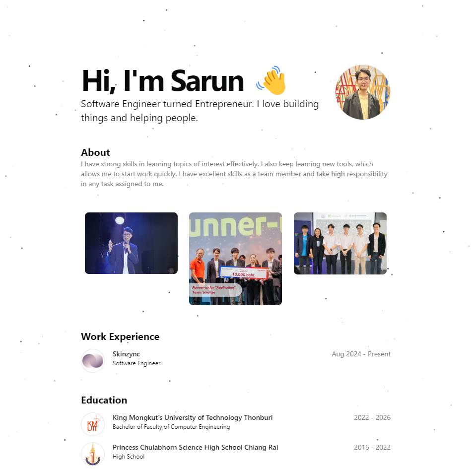
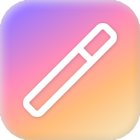

# `MYPORT`

		<em>Built with the tools and technologies:</em>

| What I use | Name |
|------------------|------|
|  | Nextjs |
|  | Tailwind |
|  | Shadcn UI |
|  | Aceternity |
|  | MagicUI |
|  | Vercel |

